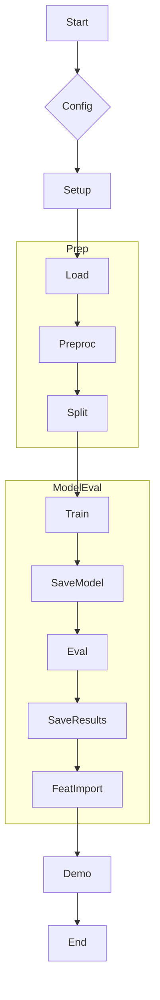

# Exo Planet Detection: Kepler Mission Data Analysis & Classification

<!-- Badges Section -->
<p align="center">
  <a href="https://github.com/AayushBadola/Exo-Planet-Detection/blob/main/LICENSE">
    
  </a>
  <a href="https://www.python.org/downloads/">
    
  </a>
  
  
  <a href="https://github.com/psf/black">
    
  </a>
  <a href="https://hydra.cc/">
    
  </a>
</p>

<p align="center">
  <em>A machine learning pipeline for detecting exoplanets from Kepler Space Telescope data, configured with Hydra.</em>
</p>

---

**Author:** Aayush Badola <br>
**Repository:** [https://github.com/AayushBadola/Exo-Planet-Detection.git](https://github.com/AayushBadola/Exo-Planet-Detection.git)

---

## Table of Contents

1.  [Introduction](#introduction)
    *   [Project Goal](#project-goal)
    *   [Dataset Overview](#dataset-overview)
    *   [Key Features](#key-features)
2.  [Project Architecture](#project-architecture)
    *   [Directory Structure](#directory-structure)
    *   [Technology Stack](#technology-stack)
    *   [Workflow Overview](#workflow-overview)
3.  [Setup and Installation](#setup-and-installation)
    *   [Prerequisites](#prerequisites)
    *   [Cloning the Repository](#cloning-the-repository)
    *   [Setting up the Virtual Environment](#setting-up-the-virtual-environment)
    *   [Installing Dependencies](#installing-dependencies)
    *   [Data Acquisition](#data-acquisition)
4.  [Configuration Management with Hydra](#configuration-management-with-hydra)
    *   [Overview of Hydra](#overview-of-hydra)
    *   [Main Configuration File (`conf/config.yaml`)](#main-configuration-file-confconfigyaml)
    *   [Configuration Groups](#configuration-groups)
    *   [Overriding Configuration Parameters](#overriding-configuration-parameters)
5.  [Data Processing Pipeline](#data-processing-pipeline)
    *   [Data Loading (`src/data_loader.py`)](#data-loading-srcdata_loaderpy)
    *   [Exploratory Data Analysis (EDA) (`notebooks/01_eda_and_preprocessing.ipynb`)](#exploratory-data-analysis-eda-notebooks01_eda_and_preprocessingipynb)
    *   [Preprocessing Strategy (`src/preprocessor.py`)](#preprocessing-strategy-srcpreprocessorpy)
    *   [Saving Preprocessing Artifacts](#saving-preprocessing-artifacts)
6.  [Model Training and Evaluation](#model-training-and-evaluation)
    *   [Model Selection (`conf/model/*.yaml`)](#model-selection-confmodelyaml)
    *   [Training Process (`src/model_trainer.py`)](#training-process-srcmodel_trainerpy)
    *   [Model Evaluation (`src/model_trainer.py`, `notebooks/02_model_training_and_evaluation.ipynb`)](#model-evaluation-srcmodel_trainerpy-notebooks02_model_training_and_evaluationipynb)
    *   [Feature Importance Analysis](#feature-importance-analysis)
    *   [Saving the Trained Model](#saving-the-trained-model)
7.  [Running the Pipeline](#running-the-pipeline)
    *   [Main Execution Script (`main.py`)](#main-execution-script-mainpy)
    *   [Command Line Execution](#command-line-execution)
    *   [Interpreting Log Outputs](#interpreting-log-outputs)
    *   [Expected Output Artifacts](#expected-output-artifacts)
8.  [Prediction Demo](#prediction-demo)
    *   [Loading Trained Model and Artifacts (`src/predict.py`)](#loading-trained-model-and-artifacts-srcpredictpy)
    *   [Preprocessing New Data for Prediction](#preprocessing-new-data-for-prediction)
    *   [Making Predictions](#making-predictions)
9.  [Hyperparameter Tuning (Conceptual)](#hyperparameter-tuning-conceptual)
10. [Code Structure and Modularity](#code-structure-and-modularity)
11. [Testing (Conceptual)](#testing-conceptual)
12. [Contribution Guidelines](#contribution-guidelines)
13. [Future Work and Potential Improvements](#future-work-and-potential-improvements)
14. [License](#license)
15. [Acknowledgements](#acknowledgements)
16. [Contact Author](#contact-author)

---
**Note :-** After running the pipeline if you want to run it again, make sure that you delete `reports`, `outputs`, `models`, `logs` and then run the pipeline

## 1. Introduction

This project is dedicated to the challenge of identifying exoplanets using machine learning techniques and data from NASA's Kepler Space Telescope. The pipeline focuses on building a classifier to distinguish promising exoplanet candidates.

### 1.1 Project Goal

The primary objective is to develop an end-to-end machine learning pipeline that can:
*   Process and clean raw Kepler exoplanet candidate data.
*   Train a classification model to predict the disposition of Kepler Objects of Interest (KOIs).
*   Evaluate model performance using appropriate metrics.
*   Provide a framework for easy configuration via Hydra.

### 1.2 Dataset Overview

*   **Dataset Name:** Kepler Objects of Interest (KOI) Cumulative Table
*   **Source:** [Kaggle Nasa Data Set](https://www.kaggle.com/datasets/nasa/kepler-exoplanet-search-results)

*   **Description:** Contains features derived from photometric time series data for KOIs, including orbital parameters, transit properties, and stellar characteristics.
*   **Target Variable:** `koi_disposition` (e.g., CONFIRMED, CANDIDATE, FALSE POSITIVE).

<details>
<summary><strong>Illustrative Key Dataset Columns</strong></summary>

| Column Name        | Description                                                                 |
|--------------------|-----------------------------------------------------------------------------|
| `kepid`            | Kepler ID of the target star.                                               |
| `koi_disposition`  | Final disposition of the KOI. **This is the target variable.**                |
| `koi_period`       | Orbital period of the KOI (days).                                           |
| `koi_duration`     | Transit duration (hours).                                                   |
| `koi_depth`        | Transit depth (parts per million, ppm).                                     |
| `koi_prad`         | Planetary radius (Earth radii).                                             |
| `koi_fpflag_nt`    | Not Transit-Like False Positive Flag (0 or 1).                              |
| ...                | *(Numerous other features and their associated error columns)*              |

> **Note:** Refer to `notebooks/01_eda_and_preprocessing.ipynb` and the [NASA Exoplanet Archive data column definitions](https://exoplanetarchive.ipac.caltech.edu/docs/API_kepcandidate_columns.html) for a complete list.

</details>

The raw data file (`cumulative.csv`) is expected in the `data/` directory.

### 1.3 Key Features

*   **Modular Pipeline:** Organized code for data loading, preprocessing, training, and prediction.
*   **Configuration Driven:** Utilizes [Hydra](https://hydra.cc/) for managing all configurations via YAML files and command-line overrides.
*   **Data Preprocessing:** Comprehensive steps including missing value imputation, feature scaling, and target variable encoding.
*   **Model Training:** Implements a Random Forest Classifier.
*   **Automated Evaluation:** Generates standard classification metrics, confusion matrices, and feature importance plots.
*   **Reproducibility Focus:** Aims for reproducible results through managed dependencies and configurable parameters.
*   **Jupyter Notebooks:** Includes notebooks for Exploratory Data Analysis and model development strategy.

---

## 2. Project Architecture

### 2.1 Directory Structure

```
📁 Exo-Planet-Detection/
├── 📁 conf/                    # Hydra configuration files
│   ├── 📁 data_paths/
│   │   └── default.yaml
│   ├── 📁 model/
│   │   └── random_forest.yaml
│   ├── 📁 preprocessing/
│   │   └── default.yaml
│   └── config.yaml            # Main configuration file
├── 📁 data/
├── 📁 logs/
├── 📁 models/                  # Saved models & preprocessing artifacts
├── 📁 notebooks/
├── 📁 reports/                 # Saved plots from evaluation
├── 📁 src/
├── .gitignore
├── main.py
├── README.md
└── requirements.txt
```

### 2.2 Technology Stack

| Category                 | Technology / Library                                      | Purpose                                            |
|--------------------------|-----------------------------------------------------------|----------------------------------------------------|
| **Language**             | Python 3.9+                                               | Core programming language                          |
| **Data Handling**        | Pandas, NumPy                                             | Data manipulation, numerical operations            |
| **Machine Learning**     | Scikit-learn                                              | ML algorithms, preprocessing, metrics              |
| **Configuration**        | Hydra                                                     | Flexible configuration management                  |
| **Serialization**        | Joblib                                                    | Saving/loading Python objects                      |
| **Visualization**        | Matplotlib, Seaborn                                       | Plotting                                           |
| **Notebooks**            | Jupyter Notebook / Lab                                    | EDA, prototyping                                   |
| **Code Formatting**      | Black                                                     | Consistent code style                              |
| **Development Environment** | VSCode (Tested On)                                     | IDE                                                |

### 2.3 Workflow Overview

The pipeline executes the following major steps sequentially:



---

## 3. Setup and Installation

### 3.1 Prerequisites

*   Python (version 3.9 or higher).
*   `pip` (Python package installer).
*   `git` (for cloning).
*   A virtual environment manager (e.g., `venv`).

### 3.2 Cloning the Repository

```bash
git clone https://github.com/AayushBadola/Exo-Planet-Detection.git
cd Exo-Planet-Detection
```

### 3.3 Setting up the Virtual Environment

```bash
python -m venv venv
# Windows:
venv\Scripts\activate
# macOS/Linux:
source venv/bin/activate
```

### 3.4 Installing Dependencies

```bash
pip install -r requirements.txt
```

### 3.5 Running the Pipeline

```bash
python main.py
```

### 3.5 Data Acquisition

1.  Download the Kepler Objects of Interest (KOI) Cumulative Table (CSV format) from the [NASA Exoplanet Archive](https://exoplanetarchive.ipac.caltech.edu/cgi-bin/TblView/nph-tblView?app=ExoTbls&config=cumulative) or your specified source.
2.  Place the file as `cumulative.csv` into the `data/` directory at the project root.
  **Note :- ** While Cloning the repo you will automatically download the data set file.
---

## 4. Configuration Management with Hydra

This project uses [Hydra](https://hydra.cc/) for managing configurations. Settings are in YAML files in `conf/`.

### 4.1 Overview of Hydra
Hydra enables composing configurations, overriding parameters via command line, and managing experiment variations.

### 4.2 Main Configuration File (`conf/config.yaml`)
The entry point for configurations, defining defaults and global settings.
```yaml
# conf/config.yaml (Simplified view)
defaults:
  - data_paths: default
  - preprocessing: default
  - model: random_forest
  - _self_

project_name: "ExoplanetDetectionKepler"
random_state: 42
test_size: 0.2

base_dir: ???
data_dir_rel: "data"
# ... other paths and settings ...
```

### 4.3 Configuration Groups
Modular configurations in `conf/` subdirectories (e.g., `data_paths/default.yaml`, `model/random_forest.yaml`, `preprocessing/default.yaml`). These define specific parameters for data, model, and preprocessing steps.

### 4.4 Overriding Configuration Parameters
Override any parameter from the command line:
```bash
# Change number of estimators for Random Forest
python main.py model.params.n_estimators=200

# Change random state and test size
python main.py random_state=123 test_size=0.3
```

---

## 5. Data Processing Pipeline

Data preparation is handled by `src/preprocessor.py`, informed by EDA in `notebooks/01_eda_and_preprocessing.ipynb`.

### 5.1 Data Loading (`src/data_loader.py`)
Loads the `cumulative.csv` using Pandas, handling comments and basic errors.

### 5.2 Exploratory Data Analysis (EDA) (`notebooks/01_eda_and_preprocessing.ipynb`)
Details initial data inspection, target variable analysis, missing value handling strategy, and feature distribution exploration.

### 5.3 Preprocessing Strategy (`src/preprocessor.py`)
The `preprocess_data` function implements:
*   **Column Name Cleaning:** Removes whitespace.
*   **Target Variable Encoding:** Maps `koi_disposition` to a binary target.
*   **Feature Dropping:** Removes identifiers and irrelevant/leaky features based on `conf/preprocessing/default.yaml`.
*   **Categorical Feature Handling:** Current strategy drops remaining object-type columns.
*   **Missing Value Imputation:** Uses `SimpleImputer` (median strategy) for numerical features.
*   **Feature Scaling:** Applies `StandardScaler` to numerical features.
*   **Polynomial Features (Optional):** Can generate interaction/polynomial terms if configured.
*   **Train-Test Split:** Splits data into training and testing sets with stratification.

### 5.4 Saving Preprocessing Artifacts
Fitted transformers (`imputer.joblib`, `scaler.joblib`, etc.) and the list of `training_columns.joblib` are saved to the `models/` directory.

---

## 6. Model Training and Evaluation

### 6.1 Model Selection (`conf/model/*.yaml`)
The project currently uses a **Random Forest Classifier**, configured in `conf/model/random_forest.yaml`. Key hyperparameters like `n_estimators`, `max_depth`, and `class_weight` are configurable.

### 6.2 Training Process (`src/model_trainer.py`)
The `train_model` function:
1.  Instantiates the model from configuration.
2.  Fits the model on the training data (`X_train`, `y_train`).
3.  Saves the trained model to a `.joblib` file in the `models/` directory.

### 6.3 Model Evaluation (`src/model_trainer.py`, `notebooks/02_model_training_and_evaluation.ipynb`)
The `evaluate_model` function assesses performance on the test set (`X_test`, `y_test`).
*   **Metrics Used:** Accuracy, Precision, Recall, F1-Score, ROC AUC, PR AUC.
*   **Classification Report:** Detailed per-class metrics.
*   **Confusion Matrix:** Visualizes prediction performance; plot saved to `reports/`.

### 6.4 Feature Importance Analysis
For the Random Forest model, `get_feature_importances` calculates and saves a plot of the top N important features to `reports/`.

### 6.5 Saving the Trained Model
The trained model is saved as `models/{model_name}_model.joblib`.

---

## 7. Running the Pipeline

### 7.1 Main Execution Script (`main.py`)
Orchestrates the entire workflow using Hydra for configuration and calling modules from `src/`.

### 7.2 Command Line Execution
1.  Activate virtual environment: `source venv/bin/activate` (or `venv\Scripts\activate` on Windows).
2.  Run with default configurations: `python main.py`
3.  Run with overrides: `python main.py model.params.n_estimators=150 test_size=0.25`

### 7.3 Interpreting Log Outputs
*   **Console Output:** Provides real-time progress and important messages.
*   **Log File (`logs/pipeline.log`):** Contains detailed, timestamped logs for debugging.

### 7.4 Expected Output Artifacts
Upon successful completion, artifacts are generated in:
*   **`models/`:** Trained model (`.joblib`), scaler, imputer, training columns.
*   **`reports/`:** Confusion matrix plot, feature importance plot.
*   **`logs/`:** `pipeline.log`.
*   **`outputs/YYYY-MM-DD/HH-MM-SS/` (Hydra default):** Contains run-specific configuration.

---

## 8. Prediction Demo

An optional prediction demonstration is included in `main.py`, controlled by `run_prediction_demo` in the configuration.

### 8.1 Loading Trained Model and Artifacts (`src/predict.py`)
Functions `load_trained_model()` and `load_preprocessing_artifacts()` load necessary files.

### 8.2 Preprocessing New Data for Prediction
`predict.preprocess_for_prediction()` applies saved transformations to new data, ensuring column alignment with training data.

### 8.3 Making Predictions
`predict.make_prediction()` uses the loaded model to predict classes and probabilities. The demo outputs a formatted table of sample predictions:

**Example Output of Prediction Demo:**
```
+----------------+-----------------+-------------------+--------------+------------------+
| Original Index | Actual Label    | Predicted Label   | Confidence   | P(Exoplanet=1)   |
+----------------+-----------------+-------------------+--------------+------------------+
|           6947 | Not Exoplanet   | Not Exoplanet     |       0.9601 |           0.0399 |
|            281 | Exoplanet       | Exoplanet         |       0.9827 |           0.9827 |
|         ...    |      ...        |       ...         |        ...   |          ...     |
+----------------+-----------------+-------------------+--------------+------------------+
```

---

## 9. Hyperparameter Tuning (Conceptual)

The `conf/config.yaml` includes a `tuning:` section for parameters like `cv_folds`, `n_trials`, and `metric_to_optimize`. While a full tuning script using a library like Optuna is not yet integrated, this structure allows for future expansion. Such an integration would involve defining an objective function to optimize and finding the best hyperparameters through multiple trials.

---

## 10. Code Structure and Modularity

The project uses a modular structure within the `src/` directory for clarity and maintainability:
*   **`config_utils.py`:** Manages path resolution and directory creation based on Hydra config.
*   **`data_loader.py`:** Handles data input.
*   **`logger_utils.py`:** Sets up consistent logging.
*   **`model_trainer.py`:** Encapsulates model training, evaluation, and saving.
*   **`predict.py`:** Provides utilities for inference.
*   **`preprocessor.py`:** Contains all data transformation and splitting logic.

---

## 11. Testing (Conceptual)

While a formal test suite is not yet implemented, future work would include:
*   **Unit Tests:** For individual functions in each module (e.g., testing preprocessing steps on mock data).
*   **Integration Tests:** For testing interactions between pipeline components (e.g., a mini-pipeline run on sample data).
*   Frameworks like `pytest` would be suitable.

---

## 12. Contribution Guidelines

This is currently a solo project. For future contributions, please:
1.  Fork the repository.
2.  Create a feature or bugfix branch.
3.  Make changes, adhering to Black code style.
4.  Add/update tests and documentation.
5.  Open a Pull Request with a clear description of changes.

---

## 13. Future Work and Potential Improvements

*   Implement advanced feature engineering techniques.
*   Explore and integrate other classification models (e.g., Gradient Boosting, Neural Networks).
*   Fully integrate hyperparameter tuning (e.g., with Optuna).
*   Develop a comprehensive test suite.
*   Enhance error analysis and diagnostics.
*   Consider data versioning (e.g., DVC).
*   Package the model for deployment as an API.

---

## 14. License

This project is licensed under the MIT License. See the [LICENSE](LICENSE) file (you'll need to create this file with the MIT license text) for details.

---

## 15. Acknowledgements

*   NASA Exoplanet Archive for the Kepler Objects of Interest data.
*   The Kepler Science Team.
*   Developers of the open-source libraries used (Python, Pandas, Scikit-learn, Hydra, etc.).

---

## 16. Contact Author

**Aayush Badola**

*   <a href="https://www.linkedin.com/in/aayush-badola-0a7b2b343/" target="_blank">
        
    </a>
*   <a href="https://github.com/AayushBadola" target="_blank">
        
    </a>
*   <a href="mailto:aayush.badola2@gmail.com">
        
    </a>

<br>
<p align="center">
  Made with ❤️ and ☕
</p>

